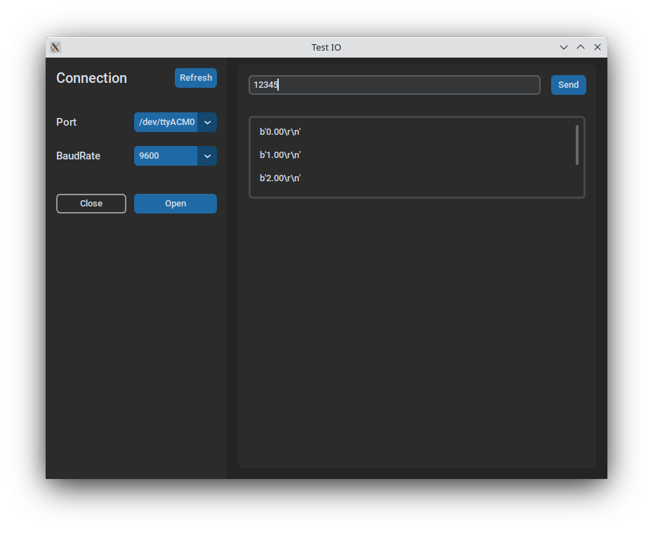

# Test-IO

## Description

Application for IO Communication

## Table of Contents

- [Installation](#installation)
- [Usage](#usage)
- [Contributing](#contributing)

## Installation

### Libraries

Installing the libraries, for python3 replace pip with pip3

    pip install customtkinter

    pip install pyserial

## Usage

To start just run the following command.

    python main.py

### Executable

Only for (Mac, Linux) change file mode

    chmod +x main.py

and start.

    ./main.py

### GUI

By default the connection baudrate is 9600

## Contributing

Information for contributions can be found at [CONTRIBUTING.md](./CONTRIBUTING.md)
